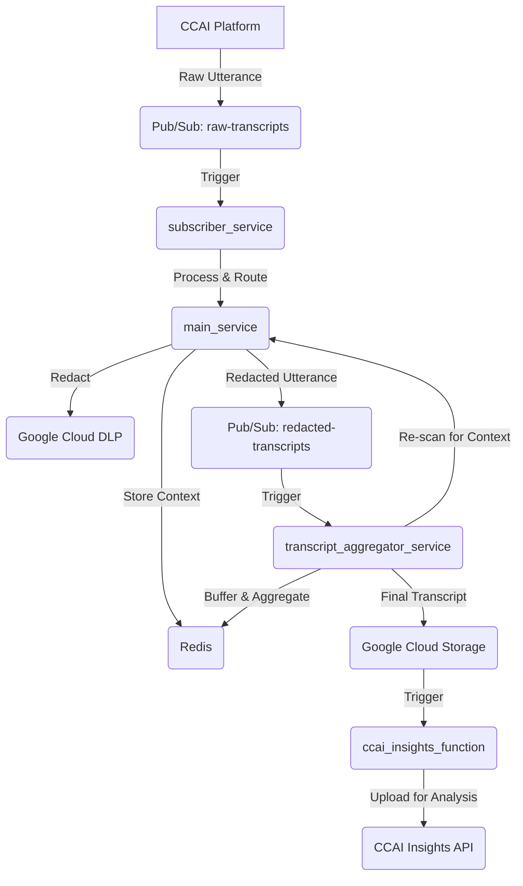
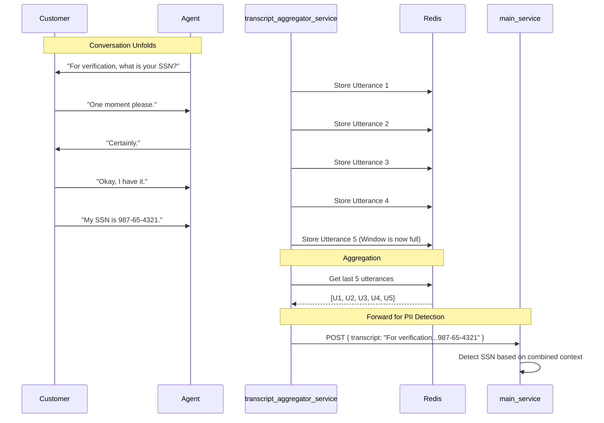

# CCAI Agent Assist Data Redaction System

## 1. System Overview

This system provides a robust, scalable pipeline for processing agent and customer transcripts from Google Cloud Contact Center AI (CCAI). Its primary purpose is to redact Personally Identifiable Information (PII) from these transcripts in near real-time using Google Cloud Data Loss Prevention (DLP). It leverages a multi-stage, microservices-based architecture to handle context-aware redaction and prepares the final transcripts for analysis in CCAI Insights.

For a more detailed technical explanation of the system, please refer to the [`TECHNICAL_DOCUMENTATION.md`](docs/TECHNICAL_DOCUMENTATION.md).

The system consists of five main components:

*   **`subscriber_service`**: A Cloud Function that acts as the initial entry point, ingesting raw transcript utterances from a Pub/Sub topic.
*   **`main_service`**: A Cloud Run service that is the core of the redaction engine. It uses Google Cloud DLP to inspect and de-identify PII, and it manages short-term conversation context using Redis.
*   **`transcript_aggregator_service`**: A Cloud Run service responsible for handling multi-turn context. It buffers recent utterances and triggers a re-scan of the conversation to catch PII that is revealed across multiple lines of dialogue. It then archives the final, redacted transcript to Google Cloud Storage (GCS).
*   **`ccai_insights_function`**: A Cloud Function that is triggered by the final transcript being saved to GCS. It uploads the completed transcript to the CCAI Insights API for long-term storage and analysis.
*   **`frontend`**: A React-based web application that provides a user interface for uploading transcripts and simulating live chat conversations.

## 2. Architecture and Data Flow

The services work in sequence to process the data. For a more detailed explanation, see the [`TECHNICAL_DOCUMENTATION.md`](docs/TECHNICAL_DOCUMENTATION.md).



## 3. File Structure

```
.
├── .gcloudignore
├── .gitignore
├── e2e_test.py
├── README.md
├── ccai_insights_function/
│   ├── cloudbuild.yaml
│   ├── Dockerfile
│   ├── main.py
│   └── requirements.txt
├── deployment/
│   ├── cloudbuild-dlp-update.yaml
│   └── update_dlp_templates.py
├── docs/
│   ├── Architecture_with_Frontend.mmd
│   ├── Architecture.mmd
│   ├── deployment-process.md
│   ├── diag1.mmd
│   ├── dlp_permission_troubleshooting.md
│   ├── dlp_sequenceDiagram.mmd
│   ├── dlp_with_dynamic_config.mmd
│   ├── projectBrief.md
│   ├── resource-monitoring.md
│   └── TECHNICAL_DOCUMENTATION.md
├── final_transcript/
│   ├── ecommerce_transcript_1.json
│   ├── ecommerce_transcript_2.json
│   └── ecommerce_transcript_3.json
├── frontend/
│   ├── cloudbuild.yaml
│   ├── Dockerfile
│   ├── package-lock.json
│   ├── package.json
│   ├── server.js
│   ├── public/
│   │   ├── favicon.ico
│   │   ├── index.html
│   │   └── manifest.json
│   └── src/
│       ├── App.css
│       ├── App.js
│       ├── firebase-config.js
│       ├── index.css
│       ├── index.js
│       └── components/
│           ├── ChatSimulator.js
│           ├── LoginScreen.js
│           ├── ResultsView.js
│           └── UploadConversation.js
├── main_service/
│   ├── cloudbuild.yaml
│   ├── dlp_config.yaml
│   ├── Dockerfile
│   ├── main.py
│   └── requirements.txt
├── subscriber_service/
│   ├── cloudbuild.yaml
│   ├── Dockerfile
│   ├── main.py
│   └── requirements.txt
└── transcript_aggregator_service/
    ├── cloudbuild.yaml
    ├── Dockerfile
    ├── main.py
    └── requirements.txt
```

## 4. Core Functionality

### `subscriber_service`

*   **Trigger**: A Cloud Function triggered by new messages on the `raw-transcripts` Pub/Sub topic.
*   **Responsibilities**:
    *   Parses the incoming raw transcript utterance.
    *   Identifies the participant's role (Agent or Customer).
    *   Makes an HTTP POST request to the appropriate endpoint on the `main_service` (`/handle-agent-utterance` or `/handle-customer-utterance`).
    *   Publishes the processed (and potentially redacted) utterance to the `redacted-transcripts` topic.

### `main_service`

*   **Trigger**: A Cloud Run service that receives HTTP requests from the `subscriber_service`.
*   **Responsibilities**:
    *   **Context Management**: For agent utterances, it parses the text to identify if a specific type of PII is being requested. If so, it stores this `expected_pii_type` in Redis with a short TTL.
    *   **PII Redaction**: For customer utterances, it calls the Google Cloud DLP API to inspect and redact PII.
    *   **Dynamic DLP**: If context (an `expected_pii_type`) exists in Redis for the conversation, it dynamically adjusts the DLP scan to increase the likelihood of finding that specific PII type, improving accuracy.
    *   Returns the redacted transcript to the `subscriber_service`.

### `transcript_aggregator_service`

*   **Trigger**: A Cloud Run service with two endpoints, both triggered by Pub/Sub push subscriptions.
*   **Responsibilities**:
    *   **Multi-Turn Context Handling** (`/redacted-transcripts` endpoint):
        *   Receives each redacted utterance from the `redacted-transcripts` topic.
        *   Stores the utterance in a Redis list that acts as a "sliding window" of the last N utterances for that conversation.
        *   Combines the text from the entire window and sends it back to the `main_service` to be re-scanned by DLP. This catches PII that is revealed across multiple turns (e.g., "My number is..." followed by "555-123-4567").
    *   **Finalization** (`/conversation-ended` endpoint):
        *   Receives a notification when a conversation has ended.
        *   Retrieves the complete, ordered set of utterances from Redis.
        *   Uploads the final, aggregated transcript to a Google Cloud Storage bucket for permanent archival.

The following diagram illustrates the multi-turn context flow:



### `ccai_insights_function`

*   **Trigger**: A Cloud Function triggered by a new file being created in the GCS bucket where final transcripts are stored.
*   **Responsibilities**:
    *   Takes the GCS path of the newly created transcript file.
    *   Calls the CCAI Insights API to upload the conversation for analysis.
    *   Includes retry logic to handle potential API errors gracefully.

### `frontend`

*   **Description**: A React application that allows users to interact with the system.
*   **Features**:
    *   **Login**: Firebase-based authentication.
    *   **Upload Conversation**: Upload a JSON transcript file.
    *   **Chat Simulator**: A real-time chat interface to simulate a conversation with the redaction system.
    *   **Results View**: Displays the redacted transcript.

## 5. CI/CD and Deployment

This project utilizes Google Cloud Build for its CI/CD pipeline. Each of the four services has its own `cloudbuild.yaml` file, allowing for independent, automated builds and deployments to Cloud Run or Cloud Functions whenever code is pushed to the main branch of the repository.

*(Note: The detailed deployment instructions and resource lists from the original README have been omitted for brevity but can be inferred from the `cloudbuild.yaml` files within each service directory.)*

## 6. Security

### 6.1. Authentication and Authorization

*   **Frontend Authentication**: The UI is secured using Firebase Authentication with Google Sign-In. Only authorized users can access the application.
*   **Backend Authorization**: The frontend and backend services exchange JWT (JSON Web Tokens) to verify requests. The frontend sends an ID token with each API request, and the backend validates the token to ensure that the request is coming from an authenticated user.

### 6.2. Secret Management

The application uses Google Cloud Secret Manager to securely store and manage sensitive information, such as API keys, database credentials, and other configuration values. The Cloud Run services and Cloud Functions are granted the necessary IAM permissions to access these secrets at runtime.

## 7. Testing

This section describes how to test the system using two different methods.

### 7.1. User Journey 1: Testing with `e2e_test.py`

This method simulates the entire data pipeline by publishing events to the Pub/Sub topics using a Python script.

**Prerequisites**:

*   Google Cloud SDK (`gcloud`) is installed and configured.
*   You are authenticated with Google Cloud: `gcloud auth login`.
*   A default project is set: `gcloud config set project YOUR_PROJECT_ID`.
*   The required Python libraries are installed: `pip install google-cloud-pubsub`.

**Steps**:

1.  **Navigate to the project root directory.**
2.  **Execute the test script**:
    ```bash
    python e2e_test.py
    ```
3.  **How it works**:
    *   The [`e2e_test.py`](e2e_test.py) script reads the sample conversation files from the [`final_transcript`](final_transcript/) directory.
    *   For each conversation, it publishes a `conversation_started` event to the `aa-lifecycle-event-notification` topic.
    *   It then publishes each utterance from the conversation to the `raw-transcripts` topic.
    *   Finally, it publishes a `conversation_ended` event to the `aa-lifecycle-event-notification` topic.
4.  **Verification**:
    *   Monitor the logs of the Cloud Functions and Cloud Run services in the Google Cloud Console.
    *   Check the `redacted-transcripts` Pub/Sub topic for redacted messages.
    *   Verify that the final, aggregated transcript is created in the GCS bucket.
    *   Confirm that the `ccai_insights_function` is triggered and successfully uploads the transcript to the CCAI Insights API.

### 7.2. User Journey 2: Testing with the UI

This method uses the frontend application to interact with the system.

**Prerequisites**:

*   The frontend application is deployed and running.
*   You have a valid user account for the application.

**Option A: Uploading a Sample Transcript**

1.  **Open the frontend application in your browser.**
2.  **Log in** to the application.
3.  **Navigate to the "Upload Conversation" section.**
4.  **Click the "Upload" button** and select one of the sample transcript files from the [`final_transcript`](final_transcript/) directory (e.g., [`ecommerce_transcript_1.json`](final_transcript/ecommerce_transcript_1.json)).
5.  **The application will then send the transcript to the backend**, which will publish the utterances to the `raw-transcripts` Pub/Sub topic.
6.  **View the redacted transcript** in the "Results View" section of the UI.

**Option B: Live Chat Simulation**

1.  **Open the frontend application in your browser.**
2.  **Log in** to the application.
3.  **Navigate to the "Chat Simulator" section.**
4.  **Start a conversation** by typing messages in the chat input field. You can play the role of both the agent and the customer.
5.  **As you send messages, the application will publish them to the `raw-transcripts` topic.**
6.  **The redacted messages will be displayed in the chat window in near real-time.**
7.  **Click the "Analyze Conversation" button** to finalize the conversation and view the full redacted transcript.