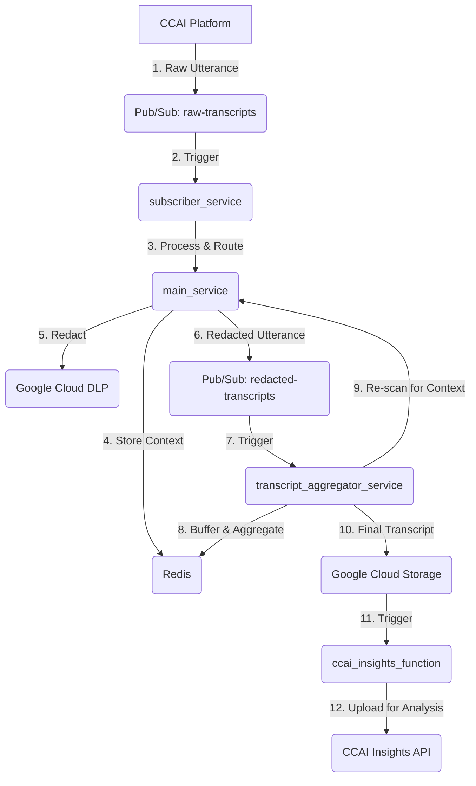
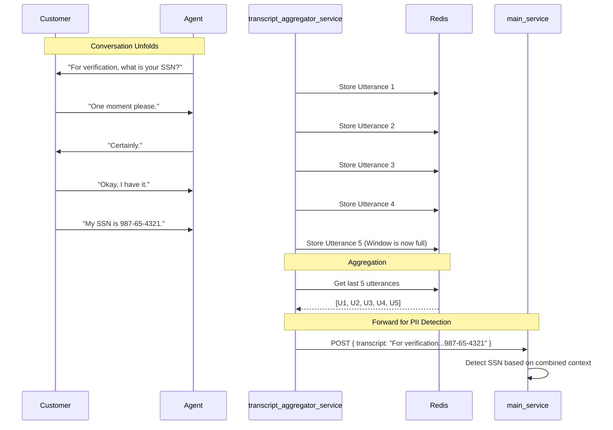

# CCAI Agent Assist Data Redaction System

## 1. System Overview

This system provides a robust, scalable pipeline for processing agent and customer transcripts from Google Cloud Contact Center AI (CCAI). Its primary purpose is to redact Personally Identifiable Information (PII) from these transcripts in near real-time using Google Cloud Data Loss Prevention (DLP). It leverages a multi-stage, microservices-based architecture to handle context-aware redaction and prepares the final transcripts for analysis in CCAI Insights.

The system consists of four main components:

*   **`subscriber_service`**: A Cloud Function that acts as the initial entry point, ingesting raw transcript utterances from a Pub/Sub topic.
*   **`main_service`**: A Cloud Run service that is the core of the redaction engine. It uses Google Cloud DLP to inspect and de-identify PII, and it manages short-term conversation context using Redis.
*   **`transcript_aggregator_service`**: A Cloud Run service responsible for handling multi-turn context. It buffers recent utterances and triggers a re-scan of the conversation to catch PII that is revealed across multiple lines of dialogue. It then archives the final, redacted transcript to Google Cloud Storage (GCS).
*   **`ccai_insights_function`**: A Cloud Function that is triggered by the final transcript being saved to GCS. It uploads the completed transcript to the CCAI Insights API for long-term storage and analysis.

## 2. Architecture and Data Flow

The services work in sequence to process the data:



## 3. File Structure

```
.
├── .gcloudignore
├── .gitignore
├── e2e_test.py
├── README.md
├── ccai_insights_function/
│   ├── cloudbuild.yaml
│   ├── Dockerfile
│   ├── main.py
│   └── requirements.txt
├── deployment/
│   ├── cloudbuild-dlp-update.yaml
│   └── update_dlp_templates.py
├── docs/
│   └── ... (Architectural diagrams and documentation)
├── main_service/
│   ├── cloudbuild.yaml
│   ├── dlp_config.yaml
│   ├── Dockerfile
│   ├── main.py
│   └── requirements.txt
├── subscriber_service/
│   ├── cloudbuild.yaml
│   ├── Dockerfile
│   ├── main.py
│   └── requirements.txt
└── transcript_aggregator_service/
    ├── cloudbuild.yaml
    ├── Dockerfile
    ├── main.py
    └── requirements.txt
```

## 4. Core Functionality

### `subscriber_service`

*   **Trigger**: A Cloud Function triggered by new messages on the `raw-transcripts` Pub/Sub topic.
*   **Responsibilities**:
    *   Parses the incoming raw transcript utterance.
    *   Identifies the participant's role (Agent or Customer).
    *   Makes an HTTP POST request to the appropriate endpoint on the `main_service` (`/handle-agent-utterance` or `/handle-customer-utterance`).
    *   Publishes the processed (and potentially redacted) utterance to the `redacted-transcripts` topic.

### `main_service`

*   **Trigger**: A Cloud Run service that receives HTTP requests from the `subscriber_service`.
*   **Responsibilities**:
    *   **Context Management**: For agent utterances, it parses the text to identify if a specific type of PII is being requested. If so, it stores this `expected_pii_type` in Redis with a short TTL.
    *   **PII Redaction**: For customer utterances, it calls the Google Cloud DLP API to inspect and redact PII.
    *   **Dynamic DLP**: If context (an `expected_pii_type`) exists in Redis for the conversation, it dynamically adjusts the DLP scan to increase the likelihood of finding that specific PII type, improving accuracy.
    *   Returns the redacted transcript to the `subscriber_service`.

### `transcript_aggregator_service`

*   **Trigger**: A Cloud Run service with two endpoints, both triggered by Pub/Sub push subscriptions.
*   **Responsibilities**:
    *   **Multi-Turn Context Handling** (`/redacted-transcripts` endpoint):
        *   Receives each redacted utterance from the `redacted-transcripts` topic.
        *   Stores the utterance in a Redis list that acts as a "sliding window" of the last N utterances for that conversation.
        *   Combines the text from the entire window and sends it back to the `main_service` to be re-scanned by DLP. This catches PII that is revealed across multiple turns (e.g., "My number is..." followed by "555-123-4567").
    *   **Finalization** (`/conversation-ended` endpoint):
        *   Receives a notification when a conversation has ended.
        *   Retrieves the complete, ordered set of utterances from Redis.
        *   Uploads the final, aggregated transcript to a Google Cloud Storage bucket for permanent archival.

The following diagram illustrates the multi-turn context flow:



### `ccai_insights_function`

*   **Trigger**: A Cloud Function triggered by a new file being created in the GCS bucket where final transcripts are stored.
*   **Responsibilities**:
    *   Takes the GCS path of the newly created transcript file.
    *   Calls the CCAI Insights API to upload the conversation for analysis.
    *   Includes retry logic to handle potential API errors gracefully.

## 5. CI/CD and Deployment

This project utilizes Google Cloud Build for its CI/CD pipeline. Each of the four services has its own `cloudbuild.yaml` file, allowing for independent, automated builds and deployments to Cloud Run or Cloud Functions whenever code is pushed to the main branch of the repository.

*(Note: The detailed deployment instructions and resource lists from the original README have been omitted for brevity but can be inferred from the `cloudbuild.yaml` files within each service directory.)*