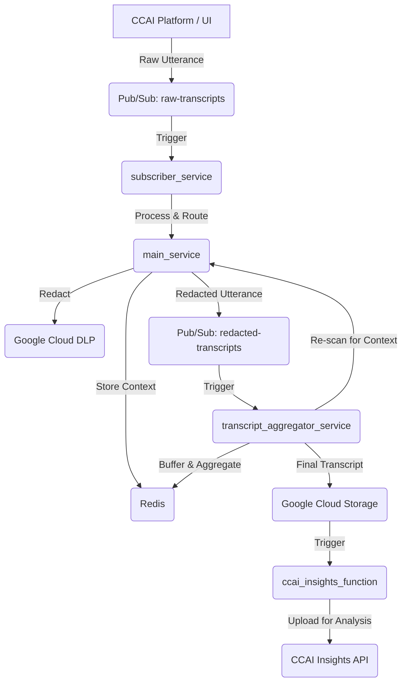

# Comprehensive Technical Documentation: CCAI Agent Assist Data Redaction System

## 1. Introduction

This document provides a comprehensive technical overview of the CCAI Agent Assist Data Redaction System. The system is a scalable, microservices-based pipeline designed to process and redact Personally Identifiable Information (PII) from agent and customer transcripts in near real-time. It leverages Google Cloud services, including Cloud Functions, Cloud Run, Pub/Sub, Data Loss Prevention (DLP), and Memorystore for Redis, to create a robust and context-aware redaction solution.

The primary goal of this system is to enhance data privacy and compliance by ensuring that sensitive customer information is de-identified before being stored or analyzed in CCAI Insights.

## 2. System Architecture

The system follows a sequential, event-driven architecture where each service performs a specific task and passes the data to the next service in the pipeline.

### 2.1. Data Flow

The data flow is orchestrated using Pub/Sub topics, which decouple the services and allow for independent scaling and development.



### 2.2. Core Components

The system is composed of four main microservices and a frontend application:

*   **`subscriber_service`**: A Cloud Function that ingests raw transcript utterances from the `raw-transcripts` Pub/Sub topic.
*   **`main_service`**: A Cloud Run service that handles PII redaction using Google Cloud DLP and manages short-term conversation context with Redis.
*   **`transcript_aggregator_service`**: A Cloud Run service that manages multi-turn context, aggregates the final transcript, and archives it to Google Cloud Storage (GCS).
*   **`ccai_insights_function`**: A Cloud Function that uploads the final, redacted transcript from GCS to the CCAI Insights API.
*   **`frontend`**: A React-based web application that provides a user interface for uploading transcripts and simulating live chat conversations.

## 3. Core Components

### 3.1. `subscriber_service`

*   **Source Code**: [`subscriber_service/main.py`](subscriber_service/main.py)
*   **Trigger**: Pub/Sub topic `raw-transcripts`
*   **Responsibilities**:
    *   Parses incoming raw transcript utterances.
    *   Identifies the participant's role (Agent or Customer).
    *   Makes an HTTP POST request to the appropriate endpoint on the `main_service` (`/handle-agent-utterance` or `/handle-customer-utterance`).
    *   Publishes the processed utterance to the `redacted-transcripts` topic.

### 3.2. `main_service`

*   **Source Code**: [`main_service/main.py`](main_service/main.py)
*   **Trigger**: HTTP requests from `subscriber_service`
*   **Responsibilities**:
    *   **Context Management**: Stores the `expected_pii_type` in Redis when an agent asks for specific PII.
    *   **PII Redaction**: Calls the Google Cloud DLP API to inspect and redact PII from customer utterances.
    *   **Dynamic DLP**: Adjusts the DLP scan based on the context stored in Redis to improve accuracy.
    *   Returns the redacted transcript to the `subscriber_service`.

### 3.3. `transcript_aggregator_service`

*   **Source Code**: [`transcript_aggregator_service/main.py`](transcript_aggregator_service/main.py)
*   **Trigger**: Pub/Sub push subscriptions from `redacted-transcripts` and `aa-lifecycle-event-notification` topics.
*   **Responsibilities**:
    *   **Multi-Turn Context Handling**: Buffers recent utterances in Redis to catch PII revealed across multiple turns.
    *   **Finalization**: Retrieves the complete conversation from Redis when a `conversation-ended` event is received.
    *   Uploads the final, aggregated transcript to a GCS bucket.

### 3.4. `ccai_insights_function`

*   **Source Code**: [`ccai_insights_function/main.py`](ccai_insights_function/main.py)
*   **Trigger**: GCS bucket event (new file creation).
*   **Responsibilities**:
    *   Uploads the final transcript from GCS to the CCAI Insights API.
    *   Includes retry logic to handle potential API errors.

### 3.5. `frontend`

*   **Source Code**: [`frontend/src/App.js`](frontend/src/App.js)
*   **Description**: A React application that allows users to interact with the system.
*   **Features**:
    *   **Login**: Firebase-based authentication.
    *   **Upload Conversation**: Upload a JSON transcript file (like the ones in [`final_transcript`](final_transcript/)).
    *   **Chat Simulator**: A real-time chat interface to simulate a conversation with the redaction system.
    *   **Results View**: Displays the redacted transcript.

## 4. CI/CD and Deployment

### 4.1. CI/CD Pipeline

The project utilizes Google Cloud Build for its CI/CD pipeline. Each service has its own `cloudbuild.yaml` file, which defines the build, test, and deployment steps.

*   **Source Code Repository**: The source code is hosted on a Git repository (e.g., GitHub, Cloud Source Repositories).
*   **Cloud Build Triggers**: Cloud Build triggers are configured to automatically initiate a build when changes are pushed to the main branch of the repository.
*   **Artifact Registry**: Docker images built by Cloud Build are stored in Google Artifact Registry.
*   **Deployment**: The `cloudbuild.yaml` files deploy the services to their respective environments:
    *   `main_service`, `transcript_aggregator_service`, and `frontend` are deployed as Cloud Run services.
    *   `subscriber_service` and `ccai_insights_function` are deployed as Cloud Functions.

### 4.2. Manual Deployment

For a detailed, step-by-step guide on how to deploy the services manually, refer to [`docs/deployment-process.md`](docs/deployment-process.md).

## 5. Security

### 5.1. Authentication and Authorization

*   **Frontend Authentication**: The UI is secured using Firebase Authentication with Google Sign-In. Only authorized users can access the application.
*   **Backend Authorization**: The frontend and backend services exchange JWT (JSON Web Tokens) to verify requests. The frontend sends an ID token with each API request, and the backend validates the token to ensure that the request is coming from an authenticated user.

### 5.2. Secret Management

The application uses Google Cloud Secret Manager to securely store and manage sensitive information, such as API keys, database credentials, and other configuration values. The Cloud Run services and Cloud Functions are granted the necessary IAM permissions to access these secrets at runtime.

## 6. Testing

This section describes how to test the system using two different methods.

### 6.1. User Journey 1: Testing with `e2e_test.py`

This method simulates the entire data pipeline by publishing events to the Pub/Sub topics using a Python script.

**Prerequisites**:

*   Google Cloud SDK (`gcloud`) is installed and configured.
*   You are authenticated with Google Cloud: `gcloud auth login`.
*   A default project is set: `gcloud config set project YOUR_PROJECT_ID`.
*   The required Python libraries are installed: `pip install google-cloud-pubsub`.

**Steps**:

1.  **Navigate to the project root directory.**
2.  **Execute the test script**:
    ```bash
    python e2e_test.py
    ```
3.  **How it works**:
    *   The [`e2e_test.py`](e2e_test.py) script reads the sample conversation files from the [`final_transcript`](final_transcript/) directory.
    *   For each conversation, it publishes a `conversation_started` event to the `aa-lifecycle-event-notification` topic.
    *   It then publishes each utterance from the conversation to the `raw-transcripts` topic.
    *   Finally, it publishes a `conversation_ended` event to the `aa-lifecycle-event-notification` topic.
4.  **Verification**:
    *   Monitor the logs of the Cloud Functions and Cloud Run services in the Google Cloud Console.
    *   Check the `redacted-transcripts` Pub/Sub topic for redacted messages.
    *   Verify that the final, aggregated transcript is created in the GCS bucket.
    *   Confirm that the `ccai_insights_function` is triggered and successfully uploads the transcript to the CCAI Insights API.

### 6.2. User Journey 2: Testing with the UI

This method uses the frontend application to interact with the system.

**Prerequisites**:

*   The frontend application is deployed and running.
*   You have a valid user account for the application.

**Option A: Uploading a Sample Transcript**

1.  **Open the frontend application in your browser.**
2.  **Log in** to the application.
3.  **Navigate to the "Upload Conversation" section.**
4.  **Click the "Upload" button** and select one of the sample transcript files from the [`final_transcript`](final_transcript/) directory (e.g., [`ecommerce_transcript_1.json`](final_transcript/ecommerce_transcript_1.json)).
5.  **The application will then send the transcript to the backend**, which will publish the utterances to the `raw-transcripts` Pub/Sub topic.
6.  **View the redacted transcript** in the "Results View" section of the UI.

**Option B: Live Chat Simulation**

1.  **Open the frontend application in your browser.**
2.  **Log in** to the application.
3.  **Navigate to the "Chat Simulator" section.**
4.  **Start a conversation** by typing messages in the chat input field. You can play the role of both the agent and the customer.
5.  **As you send messages, the application will publish them to the `raw-transcripts` topic.**
6.  **The redacted messages will be displayed in the chat window in near real-time.**
7.  **Click the "Analyze Conversation" button** to finalize the conversation and view the full redacted transcript.

## 7. Monitoring and Logging

Each service is configured to send logs to Google Cloud Logging. You can monitor the health and performance of the system using the following resources:

*   **Cloud Run Dashboards**: Monitor request count, latency, CPU/memory utilization, and error rates for the `main_service` and `transcript_aggregator_service`.
*   **Cloud Functions Dashboards**: Monitor execution count, execution time, and errors for the `subscriber_service` and `ccai_insights_function`.
*   **Pub/Sub Dashboards**: Monitor message backlog, oldest unacknowledged message age, and push/pull request counts for the Pub/Sub topics.
*   **Cloud Logging**: View detailed logs for each service to debug issues.

For a detailed guide on setting up monitoring and alerting, refer to [`docs/resource-monitoring.md`](docs/resource-monitoring.md).

## 8. Troubleshooting

This section provides guidance on how to troubleshoot common issues.

### 8.1. DLP Permission Errors

*   **Error Message**: `DLP API Error: Requested inspect/deidentify template not found`
*   **Cause**: The service account for the `main_service` does not have the required IAM permissions to access the DLP templates.
*   **Solution**: Follow the steps in [`docs/dlp_permission_troubleshooting.md`](docs/dlp_permission_troubleshooting.md) to grant the `DLP User` role to the service account.

### 8.2. Missing Redacted Transcripts

*   **Symptom**: No messages are appearing in the `redacted-transcripts` topic.
*   **Troubleshooting Steps**:
    1.  Check the logs of the `subscriber_service` to ensure it is receiving messages from the `raw-transcripts` topic.
    2.  Check the logs of the `main_service` for any errors related to DLP processing or Redis connection.
    3.  Verify that the Pub/Sub topics and subscriptions are correctly configured.

### 8.3. Incomplete Final Transcripts

*   **Symptom**: The final transcript in GCS is missing some utterances.
*   **Troubleshooting Steps**:
    1.  Check the logs of the `transcript_aggregator_service` for any errors related to Redis or GCS.
    2.  Ensure that the `conversation-ended` event is being published correctly.
    3.  Verify that the `total_utterance_count` in the `conversation-ended` event matches the actual number of utterances.